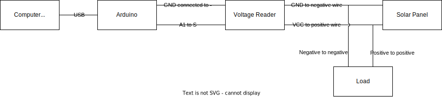

# Solar Panel Logger
Detects the voltage of a solar panel (read through an arduino) and passes that data to a server via socketio events. Also records the same data locally.

### Usage
To run, first install the required python packages:
```Bash
pip install pyserial
pip install socketio
```

Then, connect the Arduino to a computer (may be a Raspberry PI). You will need to find the port number that the Arduino is connected to (see [this article using the Arduino IDE](https://support.arduino.cc/hc/en-us/articles/4406856349970-Select-board-and-port-in-Arduino-IDE) or [this article](https://www.mathworks.com/help/supportpkg/arduinoio/ug/find-arduino-port-on-windows-mac-and-linux.html) to find the correct port). It must be changed in `solar_panel_reader.py` accordingly. You may need to upload the `solar_panel_logger.ino` file to the Arduino (which is easiest through the [Arduino IDE](https://docs.arduino.cc/software/ide-v2/tutorials/getting-started/ide-v2-uploading-a-sketch)). Start running the Arduino `solar_panel_logger.ino` file.

On your computer, run the `solar_panel_reader.py` file and it should start reading the output from the Arduino. You may need to change some of the socketio configuration values or the `arduino_port` discussed above.

Once the above preparations are complete, the general order of running the solar panel logger are as follows:
1. Sort out the hardware. Connect the arduino, voltage reader, solar panel, and any other necessary components.
2. Run `solar_panel_logger.ino` (on the Arduino, using the Arduino IDE).
3. Start the socketio server.
4. Run `solar_panel_reader.py` on your computer.


#### Connecting the Solar Panel to the Arduino
The solar panel must first connect to the voltage sensor using the provided orange and white wires. The order in which the wires connect matters, so just try both ways until you receive a value in the program.

The negative output of the voltage sensor goes in the GND port of the arduino, and the `S` output of the voltage sensor goes in the `A1` port of the arduino.

#### Solar Panel Setup Diagram


### Output
The local log is stored in `voltage_log.csv` and has the form:

| Timestamp | Voltage Value |
|---|---|

### Socketio Events
The python script will emit the following events:

| Event Name | Contained Data |
|---|---|
|"test"|{"foo":"bar"}, run once at the beginning of the script|
|"voltage" | {"voltage":voltage_value_as_an_integer, "timestamp":"Year-Month-Day Hour-Minute-Seconds"}|

The python script will properly receive the following events:

|Event Name| Action|
|---|---|
|connect | prints "Connected" |
|connect_error, disconnect, error, shutdown, stop | stops execution of the script |
| pause_local_data | pauses the recording of local data |
| start_local_data | re-starts the recording of local data |
| pause_socketio_data | pauses socketio client from emitting voltage data |
| start_socketio_data | starts emitting voltage data from socketio client |


### Other Resources
- Similar project: https://projecthub.arduino.cc/Aboubakr_Elhammoumi/9c72efc8-7307-4b24-b3b0-05247d976518
- Some documentation for the `analogRead()` function for Arduino: https://www.arduino.cc/reference/en/language/functions/analog-io/analogread/
- If you wish to read voltage from a more powerful solar panel, you may need to cut the voltage using resistors. These resistors should be placed in the circuit before the voltage reader as needed. This article contains diagrams and an equation to find the necessary ratio between the two resistors: http://www.learningaboutelectronics.com/Articles/How-to-reduce-voltage-with-resistors.php
